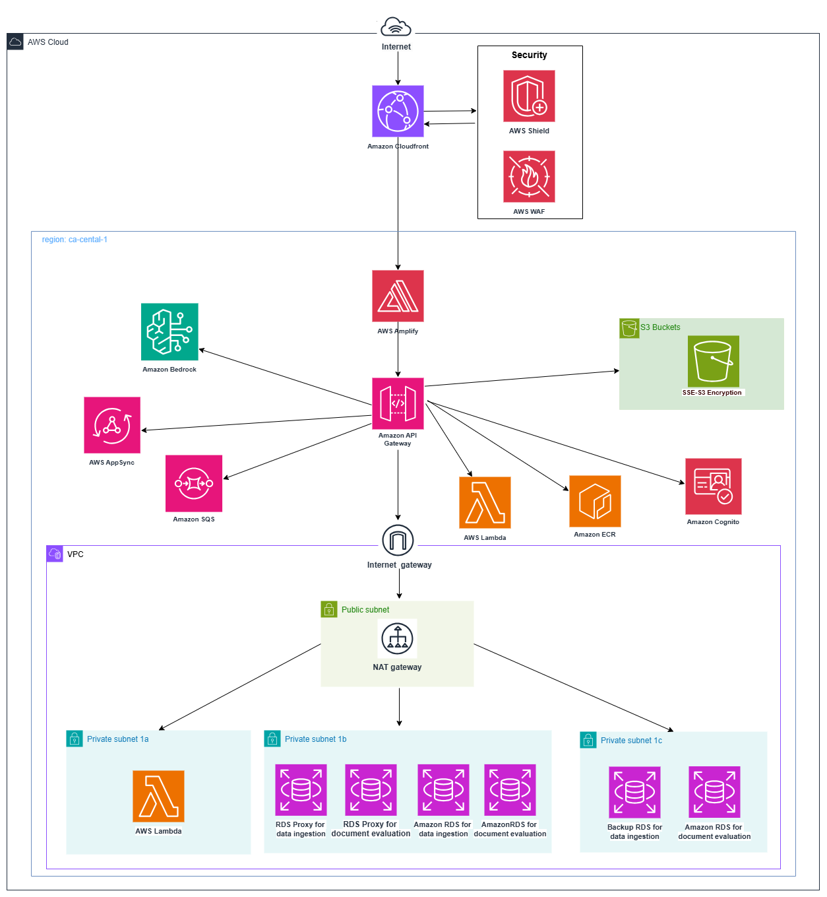
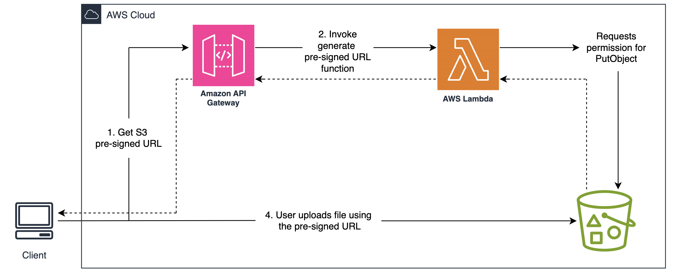

# Security Documentation & Network Architecture  

## Shared Responsibility Model 

#### The AWS Shared Responsibility Model defines the division of security responsibilities between CIC and its sponsors. At CIC, we are responsible for securing the cloud, while customers are responsible for securing their applications and data within the cloud

### CIC Responsibilities (Security of the Cloud):
- Infrastructure Security
- Network Protection 
- Compliance with Industry Security Standards
- Service-Level Security

### Customer Responsibilities (Security in the Cloud):
- Data Protection
- Identity & Access Management
- Application Security
- Network Security Configuration

[Learn more](https://aws.amazon.com/compliance/shared-responsibility-model/)

This document outlines the existing network and security configurations implemented for this project. Additionally, it provides recommendations and guidance on leveraging AWS services and features to enhance security, monitor application performance, and maintain compliance 

## 1. Network Architecture

### 1.1 VPC & Subnets  
VPC Configuration:  
- Create a new VPC for the deployment

#### Subnet Configuration:  

| Subnet Type | AZ             | Key Services                       |
|-------------|----------------|------------------------------------|
| Private     | ca-central-1a  | Lambda                             |
| Private     | ca-central-1b  | RDS Proxy for data ingestion, RDS Proxy for document evaluation, Amazon RDS for data ingestion, Amazon RDS for document evaluation  |
| Private     | ca-central-1c  | Backup RDS for data ingestion, Backup RDS for document evaluation |
| Public      | ca-central-1   | NAT Gateway, Internet Gateway      |

#### Services Deployment:  

#### Private Subnets:  
- **AWS Lambda:**   
  - Runtime environment for application logic  
  - No public IP addresses  
  - Outbound internet via NAT Gateway  

- **Amazon RDS for data ingestion/ document evaluation (PostgreSQL):**  
  - Accessed exclusively via RDS Proxy  
  - No direct public access  
  - Encrypted connections via SSL/TLS  

  Since VPC Endpoints are not used, Lambda accesses S3, ECR, and other AWS services over the public internet through the NAT Gateway.

#### Public Subnets:  
- **NAT Gateway:** [Learn more](https://docs.aws.amazon.com/vpc/latest/userguide/vpc-nat-gateway.html)

  - Required for private subnet services to fetch external packages/updates  
  - Egress-only internet access for Lambda  
  - Cost-optimized single AZ deployment  

- **Internet Gateway:** [Learn more](https://docs.aws.amazon.com/vpc/latest/userguide/VPC_Internet_Gateway.html)
  - Enables public access to API Gateway 

#### Services outside of VPC:  
- **S3 Buckets:** [Learn more](https://aws.amazon.com/pm/serv-s3/?gclid=CjwKCAiAlPu9BhAjEiwA5NDSA1VjMbPPYbzEKHPHFwna4OblKvQe5sm9sigb9iHW69Zc_pxuRifGzxoCUiEQAvD_BwE&trk=936e5692-d2c9-4e52-a837-088366a7ac3f&sc_channel=ps&ef_id=CjwKCAiAlPu9BhAjEiwA5NDSA1VjMbPPYbzEKHPHFwna4OblKvQe5sm9sigb9iHW69Zc_pxuRifGzxoCUiEQAvD_BwE:G:s&s_kwcid=AL!4422!3!536324434071!e!!g!!s3!11346198420!112250793838)
  - Accessed via NAT Gateway through Lambda functions  
  - No internet routing through NAT Gateway  

  #### How objects in S3 are accessed:

  

  The above diagram illustrates the use of S3 pre-signed URLs in our architecture. The process works as follows:

  1. Client Request: The client first requests a pre-signed URL by making an API call to the Amazon API Gateway

  2. Pre-Signed URL Generation: The API Gateway invokes an AWS Lambda function, which is responsible for generating the pre-signed URL. The Lambda function checks for the appropriate permissions (PutObject action) for the requested S3 bucket

  3. Permission Validation: If permissions are validated, the Lambda function returns the generated pre-signed URL to the client

  4. File Upload: The client uses this pre-signed URL to upload files directly to S3, bypassing the need for the server to handle large file uploads. This approach ensures:

      - Secure, time-limited access to the S3 bucket without exposing long-term credentials

      - Offloading file transfer workload from backend servers, reducing latency and cost

  Learn More:
  - [Sharing objects with presigned URLs](https://docs.aws.amazon.com/AmazonS3/latest/userguide/ShareObjectPreSignedURL.html)

  - [Download and upload objects with presigned URLs](https://docs.aws.amazon.com/AmazonS3/latest/userguide/using-presigned-url.html)
  
  
  Additional security measures:
  - All data is encrypted at rest using SSE-S3 (AES-256)
  - Public access is blocked for all S3 buckets
  - SSL connections are enforced for secure data transfer
  - Versioning is enabled

- **Amazon API Gateway:**
  - Deployed in AWS public cloud space  
  - Protected by regional security controls  
  - Custom Lambda Authorizers validate user permissions before accessing endpoints
  - Uses Cognito User Pools for authentication and role-based access control
  - IAM policies restrict API Gateway access based on user roles

- **Amazon Bedrock:**
  - Requires explicit model access requests for utilization
  - API interactions secured using IAM roles and encrypted connections

- **AWS AppSync:** 
  - Provides real-time data queries and synchronizes data between clients and backend 
  - Integrated with IAM for authentication and runs in the public cloud space
  - Real-time responses are transferred to client using websockets
  - Lambda Authorization is used for Appsync notification resolver
  - Supports secure WebSocket connections for live data updates

- **Amazon Cognito:** 
  - Provides authentication and authorization for Lambda access
  - Role-based access control via IAM roles and policies
  - Triggers (Pre-Sign-Up, Post-Confirmation, Post-Authentication) manage user provisioning.
  - Secured with Lambda authorizers

- **Amazon SQS:**
  -Provides real-time data queries and synchronizes data between clients and backend
  -Integrated with IAM for authentication and runs in the public cloud space
  -SQS queues with server-side encryption (SSE) enabled using AWS-managed keys
  -Only specific Lambda functions are granted permissions to send or receive messages
  
- **Amazon ECR:**
  - Lambda functions utilize Docker images stored in Amazon ECR 
  - Images are securely pulled over the internet via the NAT Gateway

